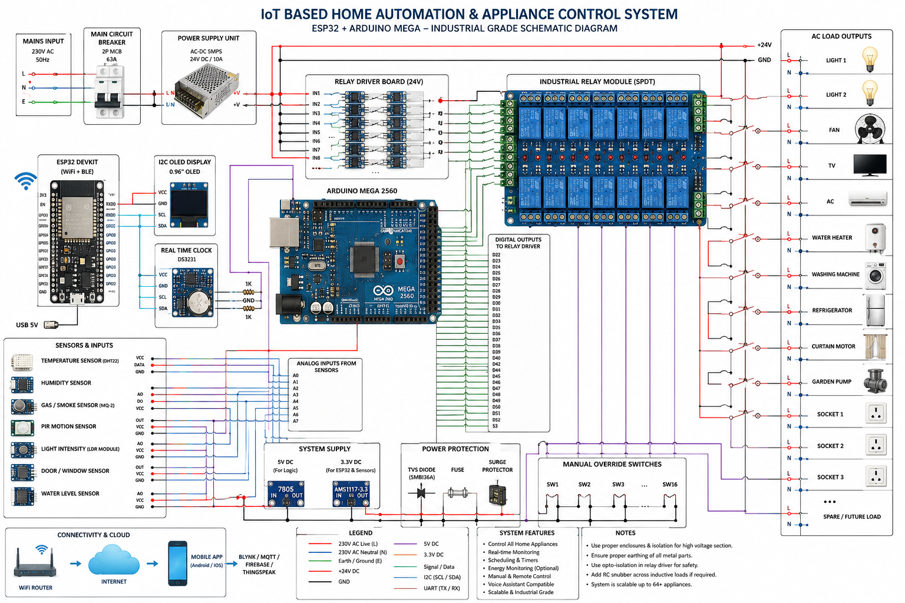

# 🏠 Industrial Grade IoT Home Automation System

An advanced **Industrial IoT Based Smart Home Automation System** using **ESP32 + Arduino Mega 2560** with MQTT cloud integration, real-time monitoring, multi-sensor support, and complete appliance automation.

---

# 🚀 Project Overview

This project is a complete enterprise-level smart home automation platform capable of controlling and monitoring an entire home infrastructure using IoT technologies.

The system combines:

- 📡 ESP32 for WiFi + MQTT Communication
- ⚙ Arduino Mega 2560 for Industrial Relay Control
- ☁ Cloud Monitoring & Remote Access
- 📱 Mobile Dashboard Support
- 🔥 Multi-Sensor Real-Time Monitoring
- ⚡ Industrial Safety Architecture

---

# ✨ Features

## ✅ Appliance Control

- Lights
- Fans
- AC
- TV
- Refrigerator
- Water Heater
- Washing Machine
- Water Pump
- Smart Curtains
- Garden Lights
- Smart Sockets

---

## ✅ Real-Time Monitoring

- Temperature Monitoring
- Humidity Monitoring
- Gas Leakage Detection
- Smoke Detection
- Motion Detection
- Water Level Monitoring
- Light Intensity Monitoring

---

## ✅ Industrial Features

- MQTT Communication
- Real-Time Cloud Sync
- Relay Status Monitoring
- Energy Monitoring
- Scheduling Automation
- Mobile App Integration
- Manual Override Support
- Expandable Architecture
- OTA Ready Structure

---

# 🧠 System Architecture

```text
MOBILE APP / CLOUD DASHBOARD
            │
            ▼
         ESP32
   (WiFi + MQTT)
            │ UART
            ▼
    Arduino Mega 2560
            │
            ▼
   16 Channel Relay Board
            │
            ▼
      Home Appliances
```

---

# 🛠 Hardware Components

| Component               | Quantity |
| ----------------------- | -------- |
| ESP32 DevKit            | 1        |
| Arduino Mega 2560       | 1        |
| 16 Channel Relay Module | 1        |
| DHT22 Sensor            | 1        |
| MQ2 Gas Sensor          | 1        |
| PIR Motion Sensor       | 1        |
| LDR Sensor              | 1        |
| Water Level Sensor      | 1        |
| OLED Display            | 1        |
| RTC DS3231              | 1        |
| SMPS Power Supply       | 1        |
| MCB Protection          | 1        |

---

# 🔌 Wiring Overview

## ESP32 ↔ Arduino Mega UART Connection

| ESP32        | Arduino Mega |
| ------------ | ------------ |
| GPIO17 (TX2) | RX1 (19)     |
| GPIO16 (RX2) | TX1 (18)     |
| GND          | GND          |

---

## Relay Pins

| Relay    | Arduino Mega Pin |
| -------- | ---------------- |
| Relay 1  | 22               |
| Relay 2  | 23               |
| Relay 3  | 24               |
| Relay 4  | 25               |
| Relay 5  | 26               |
| Relay 6  | 27               |
| Relay 7  | 28               |
| Relay 8  | 29               |
| Relay 9  | 30               |
| Relay 10 | 31               |
| Relay 11 | 32               |
| Relay 12 | 33               |
| Relay 13 | 34               |
| Relay 14 | 35               |
| Relay 15 | 36               |
| Relay 16 | 37               |

---

# 📂 Project Structure

```bash
Industrial-IoT-Home-Automation/
│
├── ESP32_Code/
│   └── esp32_controller.ino
│
├── Arduino_Mega_Code/
│   └── mega_controller.ino
│
├── Circuit_Diagram/
│   └── industrial_home_automation.png
│
├── Dashboard_UI/
│   └── smart_home_dashboard.png
│
├── README.md
│
└── LICENSE
```

---

# ⚙ Software Requirements

## Arduino IDE Libraries

Install the following libraries:

```bash
WiFi.h
PubSubClient.h
DHT.h
RTClib.h
Wire.h
```

---

# ☁ MQTT Configuration

## MQTT Broker

```bash
broker.hivemq.com
```

---

## MQTT Topics

| Topic            | Description       |
| ---------------- | ----------------- |
| home/control     | Appliance Control |
| home/temperature | Temperature Data  |
| home/humidity    | Humidity Data     |
| home/gas         | Gas Sensor        |
| home/light       | Light Sensor      |
| home/water       | Water Level       |
| home/motion      | Motion Detection  |

---

# 📡 MQTT Control Commands

## Turn Relay ON

```bash
R1ON
R2ON
R3ON
```

## Turn Relay OFF

```bash
R1OFF
R2OFF
R3OFF
```

---

# 📱 Dashboard Features

The project includes a futuristic industrial dashboard UI with:

- Real-Time Monitoring
- Relay Status Visualization
- Energy Analytics
- Sensor Graphs
- Smart Automation Scenes
- Alert System
- AI Ready Architecture

---

# 🎨 UI Design Highlights

- Dark Cyberpunk Theme
- Glassmorphism
- Neon Glow Effects
- SCADA Inspired Interface
- Responsive Layout
- Interactive Charts
- Real-Time Animation

---

# 🔥 Industrial Safety

⚠ Important Safety Recommendations:

- Use opto-isolated relay modules
- Use proper earthing
- Add MCB and fuse protection
- Never expose AC mains wiring
- Use industrial enclosures
- Use proper terminal blocks
- Maintain isolation between low voltage and high voltage sections

---

# 📈 Future Improvements

- AI Energy Optimization
- Voice Assistant Integration
- Smart Meter Analytics
- Firebase Integration
- OTA Firmware Updates
- CCTV Integration
- Face Recognition Access
- Smart Grid Monitoring
- AI Predictive Maintenance
- Mobile App Deployment

---

# 📷 Project Preview

## Industrial Dashboard UI

- Smart Home Control
- Real-Time Monitoring
- MQTT Cloud Sync
- Sensor Analytics

## Circuit Diagram

- ESP32 + Arduino Mega Architecture
- 16 Relay Automation System
- Multi Sensor Integration

---

# 🏆 Applications

- Smart Homes
- Industrial Automation
- Smart Buildings
- Energy Management
- Security Systems
- IoT Research
- Academic Projects
- Smart Cities

---

# 💡 Technologies Used

## Hardware

- ESP32
- Arduino Mega 2560
- MQTT
- Sensors
- Relay Modules

## Software

- Arduino IDE
- MQTT Protocol
- IoT Dashboard
- Cloud Integration
- Real-Time Monitoring

---

# 🤝 Contribution

Contributions are welcome.

You can:

- Improve the UI
- Add AI features
- Integrate Cloud Services
- Optimize MQTT Performance
- Enhance Security

---

# 📜 License

This project is licensed under the MIT License.

---

# 🌟 Author

SHIVAM SINGH

Developed with ❤️ using Industrial IoT Architecture.

---

# 📢 Connect & Share

If you found this project useful:

⭐ Star the repository  
⭐ Share on LinkedIn  
⭐ Fork the project  
⭐ Contribute improvements

---

# 🚀 Industrial Grade Smart Home Automation using ESP32 + Arduino Mega

"Building the Future of Intelligent Connected Homes"
